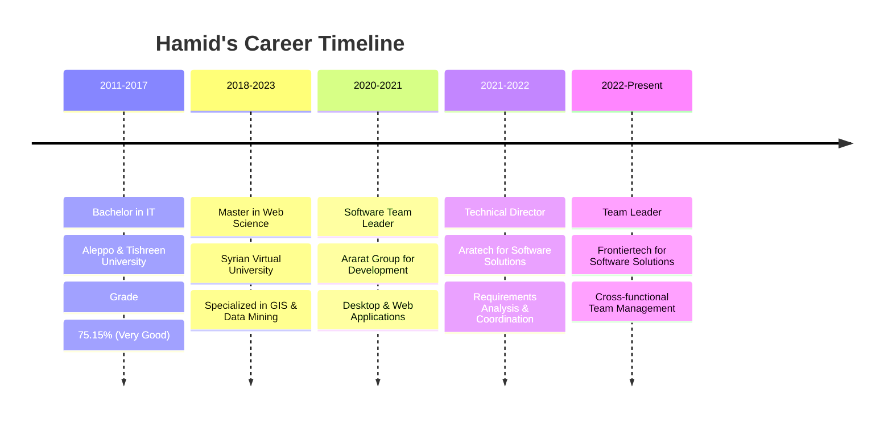

<div align="center">
  
</div>

<h1 align="center">
  
</h1>

<h3 align="center">🚀 Passionate Software Engineer & Team Leader 🚀</h3>

<div align="center">
  
  
</div>

---

## 🎯 About Me

```javascript
const hamidKano = {
    name: "Hamid Kano",
    role: "Software Engineer & Team Leader",
    location: "Al-Qamishli, Syria 🇸🇾",
    education: "Master in Web Science",
    experience: "10+ Years",
    
    currentFocus: [
        "Leading cross-functional teams",
        "Full-stack development",
        "System architecture design",
        "Process automation"
    ],
    
    lifePhilosophy: "Transforming ideas into powerful digital solutions ✨"
};
```

---

## 🛠️ Tech Arsenal

<div align="center">

### 💻 Programming Languages


### 🌐 Frontend Development


### ⚙️ Backend Development


### 🗄️ Databases


### ☁️ Cloud & DevOps


### 🎨 Design Tools


</div>

---

## 📊 GitHub Analytics

<div align="center">
  
  
</div>

<div align="center">
  
</div>

<div align="center">
  
</div>

---

## 🏆 Achievements & Highlights

<div align="center">

| 🎯 **Metric** | 📊 **Value** |
|:---:|:---:|
| **Happy Clients** | 100+ |
| **Projects Completed** | 150+ |
| **Hours of Support** | 3000+ |
| **Team Members Led** | 20+ |
| **Years of Experience** | 10+ |

</div>

---

## 💼 Professional Journey



---

## 🎯 What I Deliver

<div align="center">

| 🚀 **Service** | 📝 **Description** | 🛠️ **Technologies** |
|:---:|:---:|:---:|
| **Full-Stack Development** | End-to-end web applications with scalable architecture | React, Laravel, .NET Core |
| **System Architecture** | Robust, scalable systems with microservices | APIs, Microservices, Database |
| **Process Automation** | AI/ML solutions and workflow optimization | AI/ML, IoT, Workflows |
| **DevOps & Security** | CI/CD pipelines and cloud infrastructure | CI/CD, Cloud, Security |
| **Team Leadership** | Agile project management and mentoring | Agile, Leadership, Mentoring |
| **Technical Consulting** | Strategic technology and digital transformation | Strategy, Consulting, Planning |

</div>

---

## 🌟 Featured Projects

<div align="center">

[](https://github.com/hamidkano/arabic3english)
[](https://hamidkano.com)

</div>

---

## 🤝 Let's Connect

<div align="center">

[](https://hamidkano.com)
[](mailto:hamidkano409@gmail.com)
[](https://linkedin.com/in/hamidkano)
[](#)

</div>

---

## 💡 Programming Philosophy

<div align="center">

> *"Code is like humor. When you have to explain it, it's bad."* – Cory House

**My Approach:**
- 🎯 **Clean Code**: Write code that tells a story
- 🚀 **Performance**: Optimize for speed and efficiency  
- 🔒 **Security**: Security-first development approach
- 🤝 **Collaboration**: Team success over individual glory
- 📚 **Learning**: Never stop growing and adapting

</div>

---

## 📈 Current Focus

<div align="center">

```typescript
interface CurrentGoals {
  learning: string[];
  building: string[];
  exploring: string[];
}

const myCurrentFocus: CurrentGoals = {
  learning: [
    "Advanced System Architecture",
    "AI/ML Integration",
    "Cloud-Native Development"
  ],
  building: [
    "Arabic3English Learning Platform",
    "Automated DevOps Pipelines",
    "Microservices Architecture"
  ],
  exploring: [
    "Blockchain Technology",
    "IoT Solutions",
    "Edge Computing"
  ]
};
```

</div>

---

<div align="center">

### 🎯 Ready to Transform Ideas into Reality?

**Let's collaborate and build something extraordinary together!**

[](mailto:hamidkano409@gmail.com)
[](#)

---

**⭐ From [Hamid Kano](https://github.com/hamidkano) with ❤️**

*"Building the future, one line of code at a time"*

</div>
