<div align="center">
  
</div>

<div align="center">
  
</div>

<h1 align="center">
  
</h1>

<div align="center">
  
  
  
</div>

<br/>

<div align="center">
  
</div>

## &nbsp;***About me***

```typescript
interface Developer {
  name: string;
  role: string;
  location: string;
  experience: string;
  currentFocus: string[];
  techStack: {
    frontend: string[];
    backend: string[];
    database: string[];
    tools: string[];
  };
}

const hamidKano: Developer = {
  name: "Hamid Kano",
  role: "Full-Stack Developer & Team Leader",
  location: "Al-Qamishli, Syria 🇸🇾",
  experience: "10+ Years",
  currentFocus: [
    "Building scalable web applications",
    "Leading development teams",
    "Educational platform development",
    "System architecture design"
  ],
  techStack: {
    frontend: ["React", "TypeScript", "Next.js", "Tailwind CSS"],
    backend: ["Laravel", "Node.js", ".NET", "PHP"],
    database: ["MySQL", "PostgreSQL", "MongoDB"],
    tools: ["Docker", "Git", "Azure", "Firebase"]
  }
};
```

## <b> Skills & Technologies</b>

<div align="center">

### 🚀 Frontend Development
<p>
  
</p>

### ⚡ Backend Development  
<p>
  
</p>

### 🗄️ Databases & Cloud
<p>
  
</p>

### 🛠️ Tools & Others
<p>
  
</p>

</div>

## <b> GitHub Stats </b>

<div align="center">
  
  
</div>

<div align="center">
  
</div>

##  <b>Featured Projects</b>

<div align="center">

| 🎯 **Project** | 📝 **Description** | 🛠️ **Tech Stack** | 🔗 **Links** |
|:---:|:---:|:---:|:---:|
| **Arabic3English Platform** | Educational platform for Arabic speakers learning English | Laravel + React + TypeScript | [Demo](#) \| [Code](#) |
| **E-Learning Management** | Complete LMS with course management and progress tracking | PHP + MySQL + JavaScript | [Demo](#) \| [Code](#) |
| **Real-time Chat App** | WebSocket-based messaging application | Node.js + Socket.io + React | [Demo](#) \| [Code](#) |
| **Task Management System** | Agile project management tool | .NET Core + Angular + SQL Server | [Demo](#) \| [Code](#) |

```mermaid
timeline
    title 🚀 Career Timeline
    
    2011-2017 : 🎓 Bachelor in IT
              : Aleppo & Tishreen University
              : Programming & Information Systems
    
    2018-2023 : 🎓 Master in Web Science  
              : Syrian Virtual University
              : GIS Systems & Data Mining
    
    2020-2021 : 👨‍💻 Software Team Leader
              : Ararat Group for Development
              : Desktop & Web Applications
    
    2021-2022 : 🏗️ Technical Director
              : Aratech for Software Solutions
              : System Architecture & Analysis
    
    2022-Present : 🚀 Team Leader
                 : Frontiertech Solutions
                 : Full-Stack Development & Leadership
```

</div>

##  <b>Professional Journey</b>



##  <b>What I Do</b>

<div align="center">

| 💼 **Service** | 🎯 **Expertise** | 📊 **Impact** |
|:---:|:---:|:---:|
| **🚀 Full-Stack Development** | React, Laravel, TypeScript, APIs | 150+ Projects |
| **👥 Team Leadership** | Agile, Scrum, Mentoring, Code Review | 20+ Developers |
| **🏗️ System Architecture** | Microservices, Scalable Design, Performance | 100+ Systems |
| **📚 Educational Platforms** | LMS, Interactive Learning, Gamification | 1000+ Students |
| **☁️ DevOps & Deployment** | CI/CD, Docker, Cloud Infrastructure | 99.9% Uptime |
| **🔒 Security & Optimization** | Best Practices, Performance Tuning | 50% Speed Boost |

</div>

##  <b>Let's Connect</b>

<div align="center">

[](https://hamidkano.com)
[](mailto:hamidkano409@gmail.com)
[](#)
[](#)
[](https://wa.me/963932523445)

</div>

##  <b>Fun Facts</b>

<div align="center">

```javascript
const funFacts = {
  🌍 languages: ["Arabic (Native)", "English (Fluent)", "JavaScript (Expert)"],
  ☕ dailyFuel: "Coffee + Code = Magic ✨",
  🎯 currentGoal: "Building the future of education technology",
  🎮 whenNotCoding: ["Reading tech blogs", "Learning new frameworks", "Mentoring developers"],
  💡 motto: "Code with passion, lead with purpose, learn continuously"
};
```

</div>

---

<div align="center">
  
</div>

<div align="center">
  
</div>

<div align="center">
  <b>⭐ From <a href="https://github.com/hamidkano">Hamid Kano</a> with ❤️</b>
</div>
